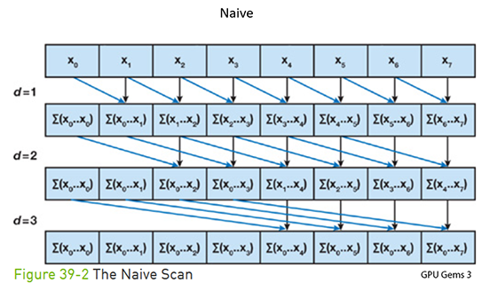
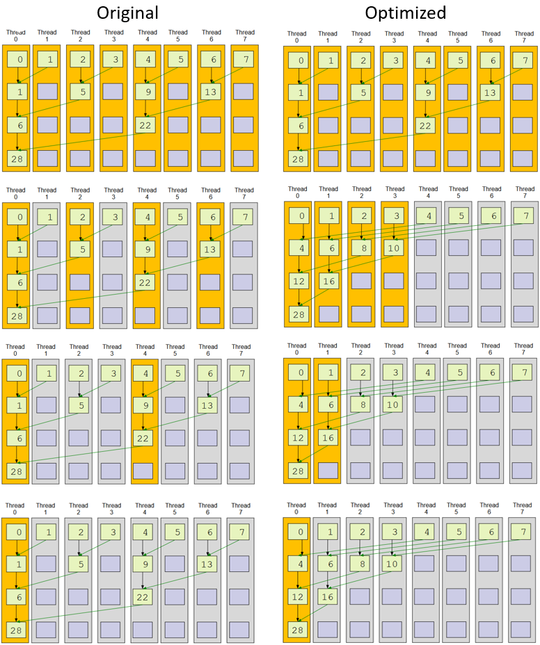

CUDA Stream Compaction
======================

**University of Pennsylvania, CIS 565: GPU Programming and Architecture, Project 2**

Hannah Bollar: [LinkedIn](https://www.linkedin.com/in/hannah-bollar/), [Website](http://hannahbollar.com/)
 
Tested on: Windows 10 Pro, i7-6700HQ @ 2.60GHz 15.9GB, GTX 980M (Personal)
____________________________________________________________________________________

   

[//]: # ( https://img.shields.io/badge/implementation-in%20progress-orange.svg)

[Introduction](#what-is-it?) - [Prefix Sum](#prefix-sum) - [Compaction](#compaction-using-prefix--sum) - [CPU Implementation](#cpu) - [GPU Implementation](#gpu) - [Additional Features](#additional-features)- [Runtime Analysis](#runtime-analysis) - [Responses](#questions)

____________________________________________________________________________________

# Stream Compaction

## Introduction

Compaction is the removal of redundant or unnecessary elements from inputted information to speed up runtime and/or shorten the amount of memory being handled.

Throughout this assignment I implement a few different versions of prefix-sum scan to form a better understanding of optimizing its implementation and then use the work-efficient version for the actual compaction method. Additionally, there is a comparison of the CPU and GPU different implementations.

### Prefix-Sum

The idea of prefix-sum is that as we hit each index in the array, we are summing up each of the elements prior to that index. For this project, I use exclusive scan, meaning when we sum up all elements up to an index, we store the value directly in that index. For example, let `A = {1, 5, 0, 1, 2, 0, 3}` be our input array and `B` be our output array. On the `0th` index, we have no sum yet, so `B[0] = 0`. On the `1st` index, we have a sum that includes the `0th` element, so our sum is `1`. That is `B[i] = A[i-1] + ... + A[0]`. So for our example we end up with `B = {0, 1, 6, 6, 7, 9, 9}` and can ignore the value 3 entirely.

### Compaction using Prefix-Sum

You map `A`'s elements to a boolean representation for whether or not the value at the index is zero. You run `prefix sum` on it and then `scatter`. That is, given an index in the original array, 1) only keep its value in the final array if the value in the binary mapping is `1` and if you're keeping it 2) place it at the index specified in the scatter array.

## CPU

### Scan on the CPU

There is one basic idea for how to implement this on the CPU - to simply iterate through a for loop over all the elements in `A` to make `B` using `prefix-sum`. Not the most optimal, but has little overhead in regards to method preparation, memory management, etc `O(n)`.

### Stream Compaction on the CPU

Just like prefix-sum, stream compaction on the CPU is also relatively a few lines of code. You map `A`'s elements to a boolean representation for whether or not the value at the index is zero. You run `prefix sum` on it and then `scatter`, which is the idea of using one array as a set of indices and one array as the original values and swapping the original values to wherever their appropriate indices are supposed to be in the output array.

## GPU

### Scan on the GPU

Since we're threading the computations here, we'd like a more optimized approach than iterating through every single element (ie we dont want it to still be a `O(n)` runtime). The code has two different implementations for this.

#### naive

When running in parrallel, each thread must have its value added to every element to the right of itself over each iteration. Since each index will need to perform at max `n` adds for this case, and our number of elements being summed only decreases by a power of two at each iteration, we have a runtime of `O(nlogn)`, which is worse than the CPU runtime of just `n`. Additionally, this algorithm has to use two buffers instead of just one, because the threads arent guaranteed to be on the same iteration as any of the others, so there will be cases where threads will be reading and writing from and to the same locations (aka race-conditions).

#### work-efficient

This implementation has two phases, the `upsweep` and the `downsweep`. 

[`upsweep`] - Instead of making all elements sum for every other index to the right in the array, this implementation cuts down all that extraneous summing. For each iteration, the values being summed are at an `offset` from one another. For each iteration, this offset increases by a power of 2, so one pair is mapping to the larger index in the pairing, which is the same thing as the next iteration's offset location. Having the values summed through based on whether or not their index value will map to the this location, shortens the number of calculations required at each iteration by powers of two. Additionally, this is just `O(n)` total add calculations.

[`downsweep`] - First set the last element from the output of `upsweep` to 0. Then, working off of the rest of the output from `upsweep`, 1) replace the value at the `upper index` in an offset pair with the sum of the `upper index` value and the `lower index` value 2) place the original `upper index` value at the lower index. What this does is that it's almost an unwrapping of the binary summing done in the `upsweep` while still doing the remaining summing as it traverses downwards passing the values along. This is just `O(n)` adds and `O(n)` swaps. 

Together they properly bring all the elements to the final scan output that we're looking for, plus overall the `upsweep` and `downsweep` sequences combined is still just `O(n)` - the same as our CPU implementation.

### Stream Compaction on the GPU

This follows the same general idea of stream compaction, just using a parrallel implementation for the boolean and scatter arrays and the `work-efficient` version of scan explained in an earlier section.

## Additional Features

### Radix Sort

I also implemented radix sorting using my `work-efficient` scan implementation. Currently it only works for arrays of lengths that are a power of 2. The non power of two handling of the feature will be fixed (tbd).

It is called on an input array and at the end of this readme in the outputs section, you can see an example input and output array printed above the confirmation that it works.

### Why is my GPU implementation slower than my CPU implementation?

This has to do with indexing and thread management. Currently in my implementation for my GPU `work-efficient` scan, my indexing follows from one iteration to another. That is for `upsweep` and `downsweep`, my thread indexing will always be the same as the offset indexing. A possible future optimization for this is to change my indexing for the threads so that as I traverse upwards and downwards for `upsweep` and `downsweep` respectively and start skipping over more and more memory, I make sure to have the output of each of these traversals be s.t. all the values remain in contiguous memory. This way, as the compiler schedules the warps, we start being able to drop off, not just threads, but entire warps and even later on blocks from our runtime calculations due to CUDA optimizations.

The below visual of the memory difference will more clearly depict the memory usage. For this example, let's say warp size is 2. After the first iteration, the compiler only has 2 warps left and is down from 8 to 4 threads, instead of in the unoptimized case where the incontiguous memory keeps all 4 blocks in play is what's actually creating the blockage.

# Runtime Analysis

## Picking a BlockSize

Before we get into a full runtime analysis explanation, let's pick out the appropriate blocksizes for each algorithm so that we're comparing the runtime of the most configuration of each technique. `Note`: this is on an array size of `1<<8 = 256`.

Based on the graph, I chose to have the most optimal configuration for the non power of two implementations since an algorithm is more likely to hit a non-power of two input than a power of two input, especially as the lengths of the input arrays increases. Therefore, I have `naive` with a `blockSize` of `32` and `work-efficient` with `1024`.

## Runtime

Now that we have the proper block sizes, let's view a comparison of all the implementations on varying array lengths.

See next section for observations.

# Questions

This is mostly just a continuation of Runtime Analysis for this assignment.

### Write a brief explanation of the phenomena you see in the comparison between the different implementations. Can you find the performance bottlenecks? Is it memory I/O? Computation? Is it different for each implementation?

`cpu` - since there's no memory overhead and manipulation, it definitely relies mainly on element count `O(n)`.

`gpu-naive` - the issue with this implementation as explained in [the gpu section](#gpu) makes the runtime `O(nlogn)` even with optimized indexing, so it will always perform worse than the cpu implementation

`gpu-work-efficient` - this is threaded so that it will run at about the same runtime as the cpu implementation `O(n)`; however, it will actually run slower than the `cpu` implementation, especially for larger array sizes. This is because it does not have the indexing optimizations I mentioned earlier. Thus the memory overhead of working with heavy input and output arrays and proper memory arrangements etc ends up adding to the overall runtime.

`thrust` - this is the fastest implementation, yet in debug mode it takes oddly a lot of time

gpu is slower than cpu for all my implementations (which is understandable given my implementation - see [Additional Features](#additional-features) for explanation)

Additionally for all, the non power of two implementations (`NPow2`) run worse than their power of two counter parts, just because of thread optimization since our warps are of size 32 and our algorithms (though they account for non power of two inputs) are more streamlined for `2^x` inputs since they divide more easily.

### Outputs

`Note`: added my own tests for radix sorting. This is the output with the optimized block sizes at `1<<8` array elements.

# References

[GPU Gems 3](https://developer.nvidia.com/gpugems/GPUGems3/gpugems3_ch39.html) - formula understanding and parts of some images

CIS 565 slide deck - parts of some of the thread images

